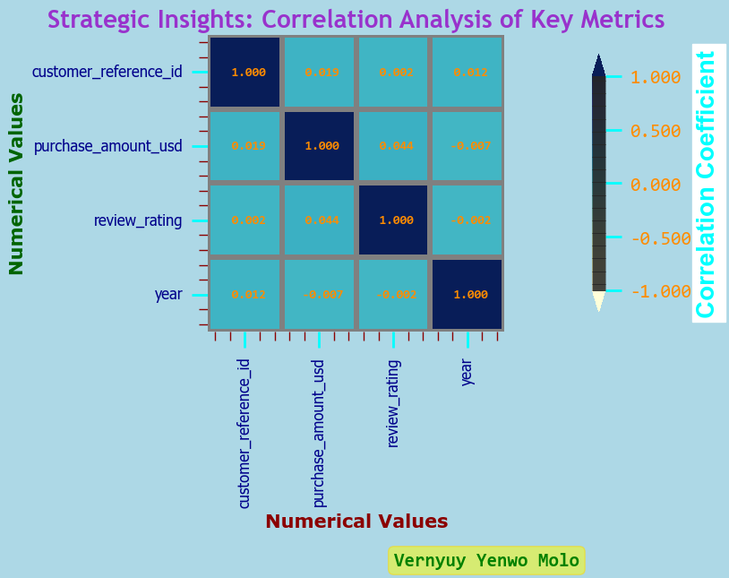
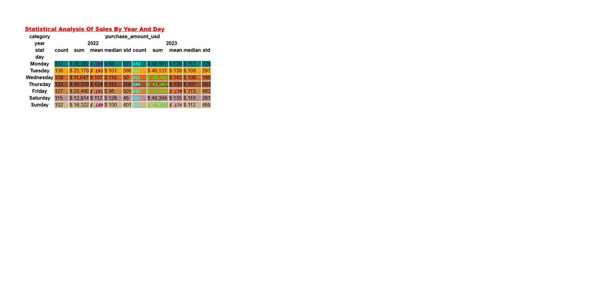
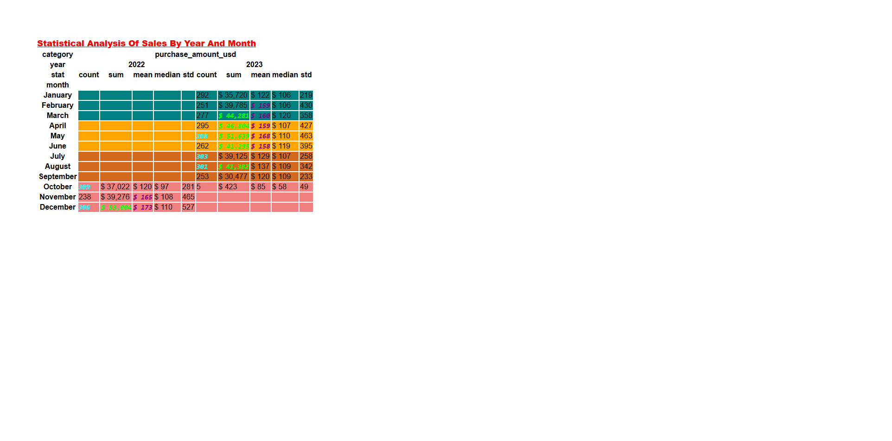
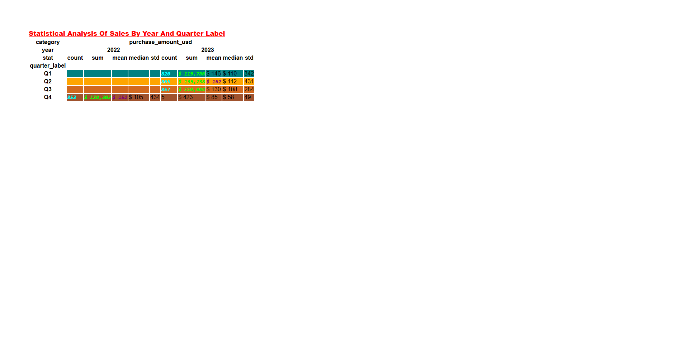
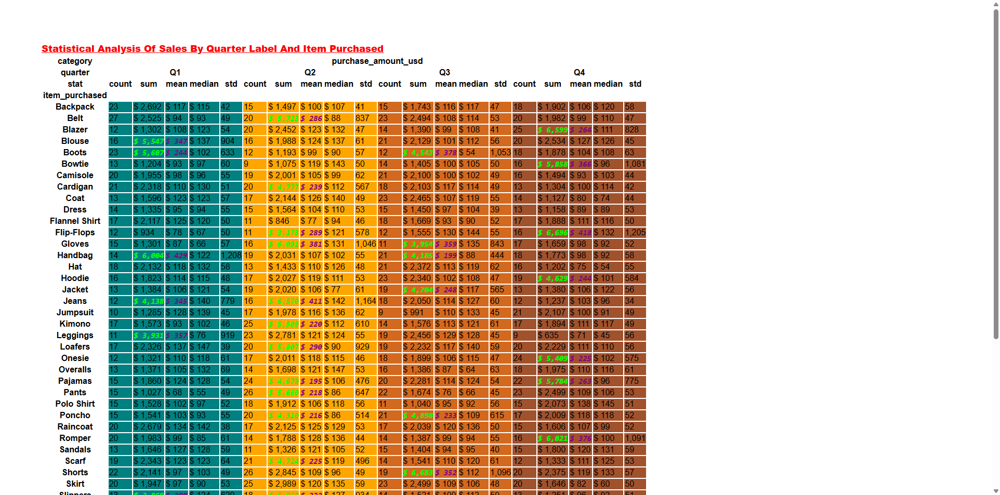
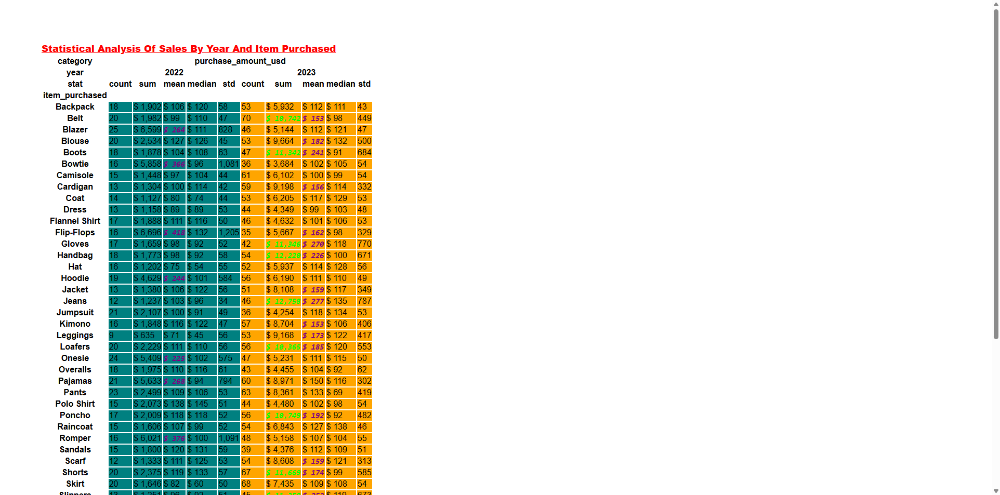

# 🩺👗🛍️ Diagnostic Sales Analysis for Fashion Retail

#

## 📌 Project Overview

**🩺 Diagnostic Analysis - Why are trends and patterns happening❓** This takes the insights found from descriptive analytics and drills down to find the causes of specific problems.

#

## 🧰 Tech Stack
- Python (`pandas`, `numpy`, `seaborn`)  
- Jupyter Notebook 

#

## 🧠 Methods & Tools

### **Python Libraries**:

- **Pandas**: Data analysis and manipulation. 
- **Numpy**: Scientific computing.  

#

## 🧠 Key Techniques & Methodologies

### 🧺 - **`TBC`**.
- **`TBC`**.
- **`TBC`**.
- **`TBC`**.
 
### Key Metrics Evaluated
- **X**: **`TBC`**. 
- **X**: **`TBC`**. 
- **X**: **`TBC`**.

### **🩺 Diagnostics**:
  - Dataframes
  
### **🔍 Insights**:
  - **`TBC`**.
  - **`TBC`**.
  - **`TBC`**.

### 📷 Visualisations

#
### 1. 💰 Strategic Insights: Correlation Analysis Of Key Metrics.

#
**Heatmap**

*Generated using pandas library*
#
### 2. 💰 Statistical Analysis Of Sales By Year And Day.

**Filter**: **`year` and `day` in `ascending order`.**
#
**Dataframe**

*Generated using pandas library*
#
### 3. 💰 Statistical Analysis Of Sales By Year And Month.

**Filter**: **`year` and `month` in `ascending order`.**
#
**Dataframe**

*Generated using pandas library*
#
### 4. 💰 Statistical Analysis Of Sales By Year And Quarter.

**Filter**: **`year` and `quarter` in `ascending order`.**
#
**Dataframe**

*Generated using pandas library*
#
### 5. 💰 Statistical Analysis Of Sales By Year And Quarter Label.

**Filter**: **`year` and `quarter_label` in `ascending order`.**
#
**Dataframe**

*Generated using pandas library*
#
### 6. 💰 Statistical Analysis Of Sales By Quarter Label And Item Purchased.

**Filter**: **`quarter_label` and `item_purchased` in `ascending order`.**
#
**Dataframe**

*Generated using pandas library*
#
### 7. 💰 Statistical Analysis Of Sales By Year And Item Purchased.

**Filter**: **`year` and `item_purchased` in `ascending order`.**
#
**Dataframe**

*Generated using pandas library*
#
## 📬 Contact
*Built by [Arkyl Trulock](https://github.com/ArkylTrulock)*  
For collaborations or feedback: X@gmail.com 