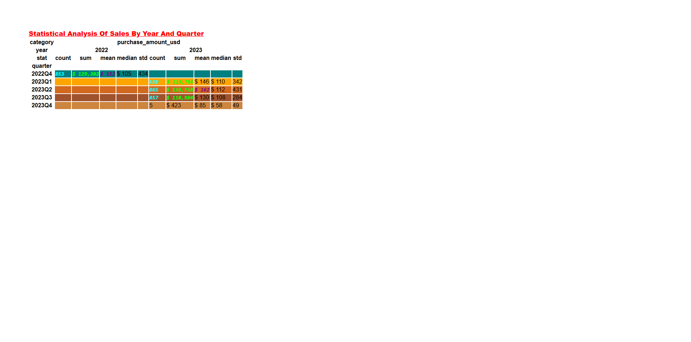

# 🩺👗🛍️ Diagnostic Sales Analysis for Fashion Retail

#

## 📌 Project Overview

**🩺 Diagnostic Analysis - Why are trends and patterns happening❓** This takes the insights found from descriptive analytics and drills down to find the causes of specific problems.

#

## 🧰 Tech Stack
- Python (`pandas`, `numpy`, `seaborn`)  
- Jupyter Notebook 

#

## 🧠 Methods & Tools

### **Python Libraries**:

- **Pandas**: Data analysis and manipulation. 
- **Numpy**: Scientific computing.  

#

## 🧠 Key Techniques & Methodologies

### 🧺 - **`Statistical Analysis`**.
1) Uses descriptive statistics to summarize and understand data distributions.
2) Employs correlation analysis to explore relationships between variables.
3) Analyses time-series data to identify trends and seasonality.
4) Utilises comparative analysis to evaluate performance across different time periods.

#

### Key Metrics
1) **Strategic Insights: Correlation Analysis Of Key Metrics**: Evaluates the relationships between different variables to identify significant correlations.. 
2) **Statistical Analysis Of Sales By Year And Day**: Examines daily sales patterns to track performance fluctuations over time. 
3) **Statistical Analysis Of Sales By Year And Month**: Analyses monthly sales trends to uncover seasonal variations and growth opportunities.
4) **Statistical Analysis Of Sales By Year And Quarter**: Studies quarterly sales data to assess overall business performance and identify growth periods.
5) **Statistical Analysis Of Sales By Year And Quarter Label**: Provides insights into sales dynamics during specific quarters, helping to pinpoint peak activity periods.
6) **Statistical Analysis Of Sales By Quarter Label And Item Purchased**: Investigates item-specific sales within quarters to understand product popularity and demand shifts.
7) **Statistical Analysis Of Sales By Year And Item Purchased**: Reviews annual sales by product category to determine bestsellers and guide inventory planning.

#

### **🩺 Diagnostics**:
  - Dataframes
  
#

### 📷 Visualisations

#

### 1. 💰 Strategic Insights: Correlation Analysis Of Key Metrics.

#
**Heatmap**

*Generated using pandas library*
#

### **🔍 Insights**
 
- **Key Insights & Interpretations:**.
  - The correlation between purchase_amount_usd and review_rating is quite low at 0.044, indicating little relationship between purchase amounts and ratings.
  - customer_reference_id shows negligible correlation with other metrics, suggesting it may not impact purchase or rating behaviors.
  - The year has a slightly negative correlation with other variables, reflecting potential temporal changes in purchasing patterns.

- **Trends And Implications:**.
  - The low correlation might suggest that customer satisfaction (rating) does not significantly affect purchase amounts.
  - Temporal aspects (year) show slight negative associations, hinting at evolving customer behaviors or economic factors over time.
  - The overall weak correlations point towards independent influences of each variable, indicating the need for multifaceted strategy development.

- **Actionable Takeaways:**.
  - Explore additional factors that might influence purchase behaviors and ratings, beyond the metrics shown.
  - Consider qualitative data or additional quantitative factors to strengthen customer insights and strategy formulation.
  - Monitor changes over time to adapt strategies to shifting customer dynamics, especially regarding temporal trends.

#

### 2. 💰 Statistical Analysis Of Sales By Year And Day.

**Filter**: **`year` and `day` in `ascending order`.**
#
**Dataframe**

*Generated using pandas library*
#

### **🔍 Insights**
 
- **Key Insights & Interpretations:**.
  - Sundays in 2023 show a remarkable increase in total sales, totaling $66,992 compared to $16,322 in 2022.
  - Mondays have the highest total sales in both years, indicating a potential peak in consumer activity at the beginning of the week.
  - The mean and median purchase amounts have generally increased from 2022 to 2023, suggesting growth in transaction values.

- **Trends And Implications:**.
  - The significant rise in Sunday sales implies a shift in consumer buying behavior, possibly due to online shopping trends or promotional strategies.
  - Increased average purchase amounts across most days suggest successful marketing or economic factors leading to higher spending.
  - Steady sales on Mondays may indicate consistent consumer demand, making it a strategic day for targeted promotions.

- **Actionable Takeaways:**.
  - Consider enhancing Sunday promotions and marketing efforts to capitalise on this increasing trend.
  - Monitor and analyse the factors driving higher purchase amounts to sustain and augment this growth.
  - Maintain focus on Monday sales initiatives to leverage its position as a strong sales day.

#

### 3. 💰 Statistical Analysis Of Sales By Year And Month.

**Filter**: **`year` and `month` in `ascending order`.**
#
**Dataframe**

*Generated using pandas library*
#

### **🔍 Insights**
 
- **Key Insights & Interpretations:**.
  - December 2022 shows the highest total sales, reaching $58,004, indicating strong holiday season performance.
  - March 2023 exhibits significant growth with a total sales increase to $44,281 from $39,276 in March 2022.
  - The mean purchase amount is generally higher in 2023, with a notable increase in January and February.

- **Trends And Implications:**.
  - Seasonal trends suggest that sales peak during the end-year holiday season, which can guide inventory and marketing planning.
  - The consistent year-over-year growth for several months points to positive overall sales momentum.
  - The decline in sales during October 2023 could indicate possible market shifts or external factors affecting purchasing behavior.

- **Actionable Takeaways:**.
  - Enhance promotional activities around the holiday season to capitalise on high consumer spending.
  - Investigate and address potential reasons for the October 2023 sales decrease to mitigate further declines.
  - Continue to invest in successful strategies from early 2023 to maintain growth trends across months.

#

### 4. 💰 Statistical Analysis Of Sales By Year And Quarter.

**Filter**: **`year` and `quarter` in `ascending order`.**
#
**Dataframe**

*Generated using pandas library*
#

### **🔍 Insights**
 
- **Key Insights & Interpretations:**.
  - Q2 2023 recorded the highest sales with a total of $189,748, showing significant improvement over previous quarters.
  - Q4 2022 was a strong period with $129,302 in sales, likely benefiting from year-end holiday shopping.
  - The decline in sales to $423 in Q4 2023 suggests a significant drop-off from previous patterns.

- **Trends And Implications:**.
  - Sales in 2023 show a strong start, particularly in Q1 and Q2, indicating effective strategies or favorable market conditions.
  - The sharp decrease in Q4 2023 sales raises questions about consumer confidence or external market factors.
  - The significant Q2 2023 performance underscores the importance of capitalising on purchasing trends during this period.

- **Actionable Takeaways:**.
  - Investigate the causes of the Q4 2023 sales decline to address potential issues and adjust strategies accordingly.
  - Ensure readiness for strong sales in Q2 by planning promotions and inventory well in advance.
  - Analyse tactics that led to Q2 success to replicate in other quarters, ensuring consistent performance throughout the year.

#

### 5. 💰 Statistical Analysis Of Sales By Year And Quarter Label.

**Filter**: **`year` and `quarter_label` in `ascending order`.**
#
**Dataframe**

*Generated using pandas library*
#

### **🔍 Insights**
 
- **Key Insights & Interpretations:**.
  - Q1 and Q2 of 2023 show strong sales performance, with Q2 reaching a total of $189,798, indicating robust growth early in the year.
  - Q4 2022 had the highest total sales of $129,302, likely driven by holiday shopping.
  - The mean purchase amount in Q2 2023 increased significantly, suggesting higher consumer spending during this period.

- **Trends And Implications:**.
  - Early 2023 has sustained high sales figures, potentially due to effective marketing or economic conditions favoring consumer spending.
  - The drop in Q4 2023 sales suggests potential market shifts or reduced consumer confidence, warranting further investigation.
  - Overall quarterly growth patterns emphasise the importance of early-year financial planning and strategy alignment.

- **Actionable Takeaways:**.
  - Focus on maintaining momentum from Q1 and Q2 through continuous promotional offers and customer engagement initiatives.
  - Evaluate factors contributing to the decline in Q4 sales to develop strategies that address these issues in future cycles.
  - Plan for strategic investments in Q1 and Q2, leveraging successful tactics to maximise sales performance.

#

### 6. 💰 Statistical Analysis Of Sales By Quarter Label And Item Purchased.

**Filter**: **`quarter_label` and `item_purchased` in `ascending order`.**
#
**Dataframe**

*Generated using pandas library*
#

### **🔍 Insights**
 
- **Key Insights & Interpretations:**.
  - T-shirts maintain high sales throughout all quarters, with Q1 having the highest total sales of $3,146.
  - The "Backpack" category shows a notable increase in Q3 with a total of $4,405, indicating a potential seasonal trend.
  - Overall, outerwear such as "Coats" and "Jackets" have strong sales, particularly in Q4, aligned with colder weather.

- **Trends And Implications:**.
  - Seasonal products like outerwear naturally peak in colder months, highlighting the importance of aligning inventory with seasonal demand.
  - The significant spike in backpack sales in Q3 suggests back-to-school trends or specific promotions during that period.
  - Consistent sales from staple items like T-shirts and Sneakers imply stable demand, valuable for steady cash flow.

- **Actionable Takeaways:**.
  - Increase inventory and marketing for seasonal and back-to-school items ahead of peak sales periods like Q3 for backpacks.
  - Maintain diverse inventory with staple items in all seasons to ensure consistent revenue streams.
  - Analyse successful marketing tactics from high-performing quarters to apply them to other product categories or periods.

#

### 7. 💰 Statistical Analysis Of Sales By Year And Item Purchased.

**Filter**: **`year` and `item_purchased` in `ascending order`.**
#
**Dataframe**

*Generated using pandas library*
#

### **🔍 Insights**
 
- **Key Insights & Interpretations:**.
  - Sales of "T-shirts" and "Sneakers" remained high in both years, with consistent demand reflected in nearly equal sales totals.
  - "Jackets" and "Coats" saw increased sales in 2023, likely due to fashion trends or climate factors.
  - "Backpacks" exhibited a significant growth in sales from $1,902 in 2022 to $5,932 in 2023, indicating a strong upward trend.

- **Trends And Implications:**.
  - The upward trend in "Backpack" sales suggests increased demand potentially driven by new promotions or market needs.
  - Consistent sales of core items like "T-shirts" indicate essential product categories that contribute to stable revenue.
  - Growth in outerwear sales in 2023 may point to shifting consumer preferences or a response to seasonal changes.

- **Actionable Takeaways:**.
  - Capitalise on the growing backpack trend by expanding marketing efforts and inventory in related periods.
  - Ensure consistent availability of staple items such as T-shirts and Sneakers to maintain steady cash flow.
  - Explore targeted campaigns for expanding outerwear lines, focusing on consumer preferences and seasonal adjustments.

#

### Key Metrics And Evaluations
1) **Strategic Insights: Correlation Analysis Of Key Metrics**: **`Analysed the relationships between key variables, showing minimal correlation among customer behaviors`**. 
2) **Statistical Analysis Of Sales By Year And Day**: **`Highlights strong daily sales trends, with increasing values in 2023, especially on Sundays`**. 
3) **Statistical Analysis Of Sales By Year And Month**: **`Identified seasonal peaks, with consistent growth in purchase amounts across most months in 2023`**.
4) **Statistical Analysis Of Sales By Year And Quarter**: **`Revealed significant quarterly growth in 2023, driven by robust early-year performance`**.
5) **Statistical Analysis Of Sales By Year And Quarter Label**: **`Demonstrated shifts in quarterly sales, with substantial activity in early quarters of 2023`**.
6) **Statistical Analysis Of Sales By Quarter Label And Item Purchased**: **`Showed item-specific trends and seasonal sales spikes, particularly in outerwear and back-to-school items`**.
7) **Statistical Analysis Of Sales By Year And Item Purchased**: **` Highlighted growth in staple items, with backpacks showing a strong sales increase in 2023`**.

#

### 🎯 Final Thoughts
- **`The analysis revealed a strong upward trend in sales for 2023, particularly in key categories like backpacks and outerwear, indicating effective marketing and seasonal alignment`**.
- **`Consistent demand for staple items like T-shirts and Sneakers highlights the importance of core product offerings, suggesting stable consumer preferences that can be leveraged for long-term planning`**.

#

## 📬 Contact
*Built by [Arkyl Trulock](https://github.com/ArkylTrulock)*  
For collaborations or feedback: X@gmail.com 