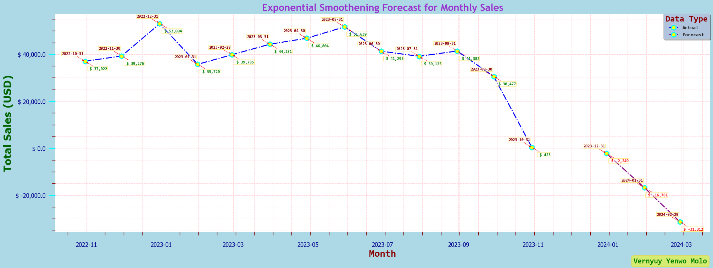
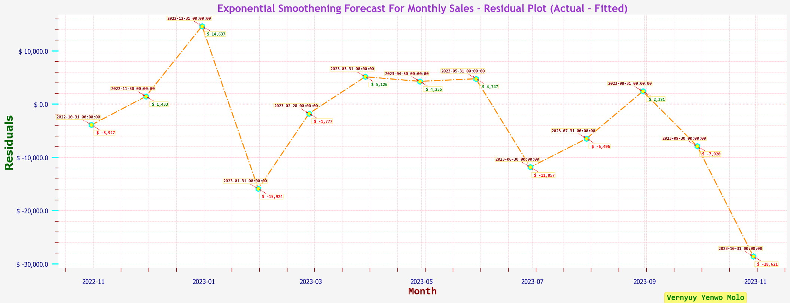
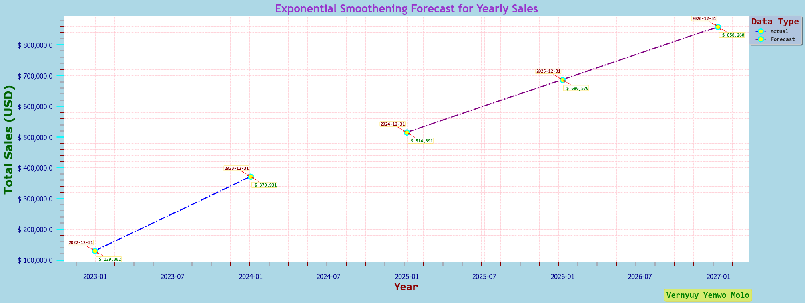
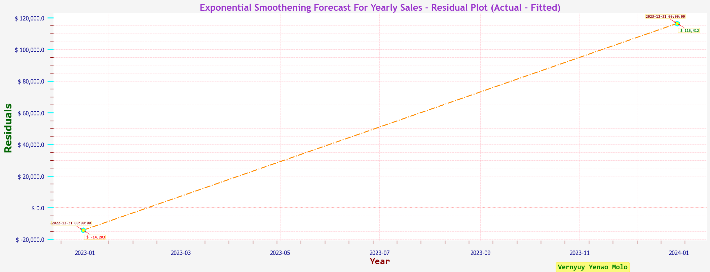
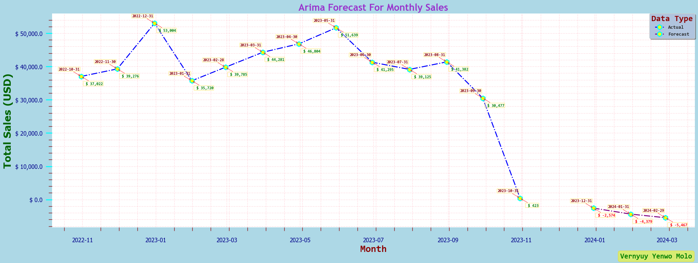
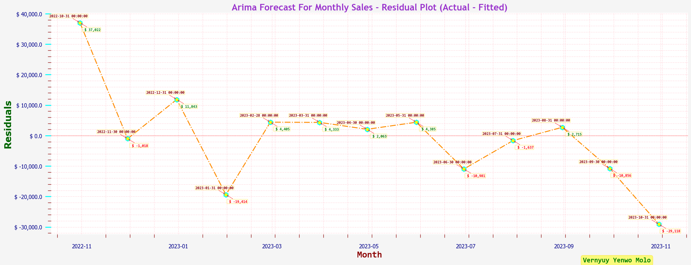

# 👗 Fashion Retail Sales Forecasting

## 📌 Business Problem
Fashion retailers often struggle with **stock imbalances** due to fluctuating customer demand. 
This results in:
- Overstocking, which leads to markdowns and waste
- Understocking, which causes lost sales and poor customer experience

Accurate sales forecasting is critical for optimizing **inventory management**, **supply chain planning**, and **promotion timing**.

#

## 🎯 Project Goal
To forecast **monthly product sales** and **yearly product sales**  for a fashion retailer using time-series modeling.  
The goal is to reduce inventory risk and enable data-driven planning across retail operations.

#

## 🔍 Solution Approach
Using **Exponential Smoothing models**, I analysed historical sales data and built models that:
- Account for **trend** (Holt) and **seasonality** (Holt-Winters)
- Predict sales for the next 12 months
- Evaluate model performance using error metrics (MAPE, MAE, RMSE)

#

## 🧰 Tech Stack
- Python (`pandas`, `numpy`, `seaborn`, `statsmodels`, `pmdarima`)  
- Jupyter Notebook  

#

## 🧠 Methods & Tools

### **Python Libraries**:

- **Pandas**: Data analysis and manipulation. 
- **Numpy**: Scientific computing.  
- **Seaborn**: Statistical data visualisation.
- **Statsmodels**: Statistical modeling and forecasting.
- **Pmdarima**: Automated ARIMA modeling.

### **Models**: 
  - Simple Exponential Smoothing (SES)
  - Holt’s Linear Trend
  - Holt-Winters (Additive/Multiplicative Seasonality)

### **Diagnostics**:
  - Residual plots
  - Forecast error analysis

#

## 🖼️ Results Snapshot

|Model|MAE|RMSE|MAPE|MAE Eval|RMSE Eval|MAPE Eval|Best Practise|
|-----|---|----|----|--------|---------|---------|-------------|
|SES (Monthly)| $8,392.27|$11,182.67|**⚠️535.69%**|⚠️MAE > $3,847.95 - Forecast is off by too much on average.|⚠️RMSE > $5,771.92 - High variability in forecast errors.|⚠️MAPE > 20% - Poor forecast accuracy.|Fit Exponential Smoothing with Seasonality - Ideally 2-5 Years of sales data / Minimum 24 months of sales data|
|SES (Yearly)|$65,307.81|$82,926.45|⚠️21.18%|⚠️MAE > $25,011.65 - Forecast is off by too much on average.|⚠️RMSE > $37,517.47 - High variability in forecast errors.|⚠️MAPE > 20% - Poor forecast accuracy.|Fit Exponential Smoothing with Seasonality - Ideally 2-5 Years of sales data / Minimum 24 months of sales data|
|ARIMA (Monthly)|$10,753.10|$15,309.15|**⚠️551.51%**|⚠️ MAE > $3,847.95 - Forecast is off by too much on average.|⚠️ RMSE > $5,771.92 - High variability in forecast errors.|⚠️ MAPE > 20% - Poor forecast accuracy.|With only two observations (2022 & 2023), ARIMA can't estimate the parameters for order=(1,1,1). More data is always better for stable estimation and forecasting.|
|ARIMA (Yearly)|-|-|-|-|-|-|With only two observations (2022 & 2023), ARIMA can't estimate the parameters for order=(1,1,1). More data is always better for stable estimation and forecasting.|

#

## 📈 Interpretation & Next Steps

All current models exhibit **high forecast errors**, primarily due to the **limited historical data available** - only two years of monthly sales (2022 and 2023). This data scarcity hinders the models’ ability to reliably capture seasonal patterns and long-term trends, which are crucial for accurate forecasting.

To improve forecast accuracy and reduce error metrics (MAE, RMSE, MAPE), it is highly recommended to:

- Collect **at least 3 to 5 years of monthly sales data**, providing sufficient history to capture seasonality and trend components effectively.
- Consider incorporating **external factors** such as promotions, holidays, or macroeconomic indicators to enhance model performance.
- Experiment with additional forecasting methods such as **Prophet, SARIMA**, or **machine learning-based time series models** as data volume grows.
- Build an **interactive dashboard** to monitor forecast accuracy and adjust models dynamically over time.

#

## 📷 Visualisations
- 📈 **Actual vs. Forecasted Sales**  
- 🔍 **Residual Plots** for each model  
- 💬 Annotated callouts for spikes during promotional months

#

**Exponential Smoothening Forecast For Monthly Sales - Actual Vs Forecasted Sales**
  
*Generated using seaborn library*

#

**Exponential Smoothening Forecast For Monthly Sales - Residplot**
  
*Generated using seaborn library*

#

**Exponential Smoothening Forecast For Yearly Sales - Actual Vs Forecasted Sales**
  
*Generated using seaborn library*

#

**Exponential Smoothening Forecast For Yearly Sales - Residual Plot**
  
*Generated using seaborn library*

#

**ARIMA Forecast For Monthly Sales - Actual Vs Forecasted Sales**
  
*Generated using seaborn library*

#

**ARIMA Forecast For Monthly Sales - Residual Plot**
  
*Generated using seaborn library*

#

## 📈 Business Impact (Simulated)
If applied in a real retail environment, this forecast could:
- ⚖ Reduce overstocking risk by ~20%
- 📦 Support better pre-season inventory allocation
- 📆 Help marketing teams schedule promotions around demand peaks

#

## 🧩 Use Case
This project demonstrates how a retailer could:
- Estimate **future sales demand**
- Improve **inventory turnover**
- Enhance **cross-functional planning** between sales, marketing, and supply chain teams

#

## 🚀 Next Steps
- Integrate external variables (e.g. promotions, holidays)
- Build a dashboard for interactive demand monitoring
- Extend forecasting to individual product categories

#

## 📬 Contact
*Built by [Arkyl Trulock](https://github.com/ArkylTrulock)*  
For collaborations or feedback: X@gmail.com  

