# 💊👗🛍️ Prescriptive Sales Analysis for Fashion Retail

#

## 📌 Project Overview

This project focuses on **Prescriptive Analytics** techniques to identify **what actions to take** to optimise sales and customer retention in a fashion retail setting. Building on previous descriptive and predictive analyses, we dive into:

- 🧺 **Basket Analysis** using the **Apriori Algorithm & Association Rule Mining**  
- 📈 **Time-Based Promotional Effectiveness** a powerful tool used to drive sales, increase engagement, and achieve marketing goals. Success is contingent on careful consideration of various factors.
- 💥 **Sales Lift Analysis** comparing pre-, during-, and post-promotion periods  
- 📊 **Customer Segmentation** using **RFM (Recency, Frequency, Monetary) Analysis + CLTV (Customer lifetime value)**  
- 🧪 **Campaign Simulation & Optimisation** for targeting high-value segments

#

## 🧰 Tech Stack
- Python (`pandas`, `numpy`, `seaborn`, `sklearn`, `statsmodels`,`prophet`, `pmdarima`, `networkx`, `mlxtend`, `lifetimes`)  
- Jupyter Notebook 

#

## 🧠 Methods & Tools

### **Python Libraries**:

- **Pandas**: Data analysis and manipulation. 
- **Numpy**: Scientific computing.  
- **Seaborn**: Statistical data visualisation.
- **Scikit-learn**: Clustering and uplift modeling.
- **Statsmodels**: Statistical modeling and forecasting.
- **Networkx**: Creation, manipulation, and study of the structure, dynamics, and functions of complex networks.
- **Mlxtend**: Apriori Association Rules.
- **Lifetimes**: Forecasting CLTV (Customer lifetime value).

#

## 🧠 Key Techniques & Methodologies

### 🧺 Apriori Algorithm & Association Rule Mining
- Association rule mining has become essential for businesses aiming to understand customer behaviours and purchasing patterns. 
- This technique identifies items frequently bought together, helping companies optimize product placement, promotions, and recommendations.
- Such analysis improves business strategies by clearly revealing trends hidden within transaction data.
 
### Key Metrics Evaluated
- **Support**: The frequency with which an item appears in the dataset. **(`How often the rule occurs in data`)** 
- **Confidence**: The likelihood that item B is purchased when item A is purchased. **(`Probability of B given A`)**
- **Lift**: The strength of a rule. **(`measuring how much more likely item B is bought when item A is bought compared to when bought independently`)**

### **🩺 Diagnostics**:
  - Network Plots
  - Barplots

### **🔍 Insights**:
  - Lift score **`> 1`** indicates a **`strong positive association between items and not likely due to random chance`**.
  - Confidence score **`> 0.6`** indicates a **`stronger relationship between the antecedent (if purchased) and consequent (will likely be purchased) item, suggesting the rule is more reliable`**.
  - Support score **`> 0.2`** indicates a **`more frequently occurring itemset in the dataset`**. A lower score indicates a **`less frequently occuring itemset in the dataset`**.

### 📷 Visualisations

#
**Network Plot 1 - Top 10 Items Purchased - Association Rules By Lift**
  
*Generated using seaborn library*
#
**Network Plot 2 - Top 10 Items Purchased - Association Rules By Confidence And Lift**
  
*Generated using seaborn library*
#
**Barplot - Top 10 Items Purchased - Association Rules By Confidence**
  
*Generated using seaborn library*
#
**Barplot - Top 10 Items Purchased - Association Rules By Lift**
  
*Generated using seaborn library*
#

### 🛒 Time-Based Promotion Effectiveness
- Analysed impact of promotional events on sales volume
- Categorised sales into:
  - **Pre-Promotion**
  - **During Promotion**
  - **Post-Promotion**

### **🩺 Diagnostics**:
  - Line Plots.

### **🔍 Insights:**
 - Shaded areas indicate active promotional campaigns.
 - You can observe spikes or trends in sales and ratings during these periods.
 - Helps evaluate campaign success visually.

### 📷 Visualisations

#
**Lineplot - Time-Based Promotional Effectiveness**
  
*Generated using seaborn library*
#
**Lineplot - Time-Based Promotional Effectiveness With Promotion Overlays**
  
*Generated using seaborn library*
#

### 📉 Sales Lift Analysis (Pre vs During vs Post Promotion)
- Quantified the **true effectiveness** of promotions.
- Metrics included:  
  - Absolute sales change.
  - Relative % improvement.
  - Baseline vs. uplift performance.

### 🧮 Lift Math
- Lift vs Pre (%) = ((During - Pre) / Pre) × 100
- Lift vs Post (%) = ((During - Post) / Post) × 100

### **🩺 Diagnostics**
  - Barplot.

### 🖼️ Results Snapshot

#
|Promotion|Pre_Sales|During_Sales|Post_Sales|Lift_vs_Pre(%)|Lift_vs_Post(%)|
|---------|---------|------------|----------|--------------|---------------|
Summer Sale|0.0|0.0|0.0|N/A|N/A|
Black Friday|$ 20,474.0|$ 4,263.0|$ 20,689.0|🔻-79.18 %|🔻-79.39 %|
End-of-Year Sale|$ 26,798.0|$ 22,311.0|$ 13,361.0|🔻-16.74 %|🔼66.99 %|
#

### **🔍 Insights:**

- **Summer Sale**: No data available for analysis.
- **Black Friday**: Sales significantly dropped during the promotion compared to both pre and post periods.
- **End-of-Year Sale**: Slight drop during the promotion vs pre-period, but significantly higher than post-period → demand likely pulled forward.

### 📷 Visualisation

#
**Barplot - Sales Lift Analysis: Pre Vs During Vs Post Promotion**
  
*Generated using seaborn library*
#

### Customer Segmentation Using RFM Analysis And K-Means Clustering With Targeting Strategy And Marketing Channels

#### What is K-Means Clustering?
- Unsupervised machine learning technique that allows the identification of clusters (similar groups of data points) within the data.

### Key Metrics Evaluated

#### RFM Analysis
- Calculated **`RFM metrics`** per customer.
  - **Recency**: Days since last purchase (how recently the customer bought).
  - **Frequency**: Total number of purchases.
  - **Monetary**: Total spending.

- Scored each RFM metric on a scale of **`1`** to **`5`** using quantiles.
  - Higher scores indicate better performance, except Recency (lower is better).

- Combined the RFM metric scores into **`RFM Segment`**.

- Calculated the **`RFM Score`** totals by summing the values in **`RFM Segment`**.

#### K-Means Clustering
- Selected only the numerical features of the RFM metrics, standardised data and chose the optimal number of clusters **`(k = 4)`** using the **`Elbow Method`**.
  - The **`k value`** corresponding to the **`"elbow"`** in the WCSS vs k graph is considered the optimal choice.

- Grouped RFM metrics by cluster and calculated :
  - Mean RFM metric scores.
  - Customer counts.

### Dataframe Columns
  - **`Cluster`**: **3**, **2**, **1** and **0**.
  - **`Customer_Count`**: **The total number of customers**.
  - **`Recency`**: **The number of days since last purchase**.
  - **`Frequency`**: **The number of purchases**.
  - **`Monetary`**: **The total revenue/profit generated**.
  - **`RFM_Score`**: **Mean metric score**.
  - **`Profile summary`**: **"Champions"**, **"Loyal"**, **"Potential"**, **"At Risk"** and **"Lost"**.
  - **`Customer Value`**: **"Very High"**, **"High"**, **"Medium"**, **"Low"** and **"Very Low"**.
  - **`Recommended Strategy`**: 
    - **Exclusive offers, loyalty rewards**.  
    - **Early access, product sneak peeks**.
    - **Nurture campaigns, discounts, product education**.
    - **Re-engagement offers, feedback surveys**.
    - **Win-back with bold offers, remove after attempts**.
  - **`Marketing Channel`**: 
    - **Email, VIP newsletters, App push.**. 
    - **SMS, Email drip campaigns, Loyalty app.**.
    - **Retargeting Ads, Email, Social media**.
    - **Email reactivation, Discount codes, SMS**.
    - **Paid Ads, Remarketing, Personalised mail**.
    
### **🩺 Diagnostics**
  - Line Plots.
  - Barplot.
  - Scatterplots.
  - Heatmap.
  - Countplot.
  - Scatterplot.

### 🖼️ Results Snapshot

#
|Cluster|Recency|Frequency|Customer_Count|Monetary|RFM_Score|Profile Summary|Customer Value|Recommended Strategy|Marketing Channel|
|-------|-------|---------|--------------|--------|---------|---------------|--------------|--------------------|------|
|0|13.83|16.69|54|$ 2,039.30|7.04|🔃 New / Promising|🥉 Medium|Nurture campaigns, discounts, product education.|Retargeting Ads, Email, Social media.|
|1|58.32|17.32|22|$ 2,087.50|4.77|❗At-Risk / Churned|🎁 Low|Re-engagement offers, feedback surveys.|Email reactivation, Discount codes, SMS.|
|2|12.89|23.71|63|$ 2,679.35|11.11|✅ Loyal Customers|🥈 Medium-High|Early access, product sneak peeks.|SMS, Email drip campaigns, Loyalty app.|
|3|16.04|23.11|27|$ 6,495.81|11.89|💎 Champions / VIP|🥇 Very High|Exclusive offers, loyalty rewards.|Email, VIP newsletters, App push.|
#

### **🔍 Insights**
 - **TBC**.

### 📷 Visualisation

#
**Lineplot - K-Means Clustering - Identifying The Optimal Number Of Clusters `(k)` Using The Elbow Method**
  
*Generated using seaborn library*
#
**Barplot - RFM Metric Scores, Customer Count, Customer Value, Profile Summary, Recommended Strategy And Marketing Channel Of KMeans Clusters**
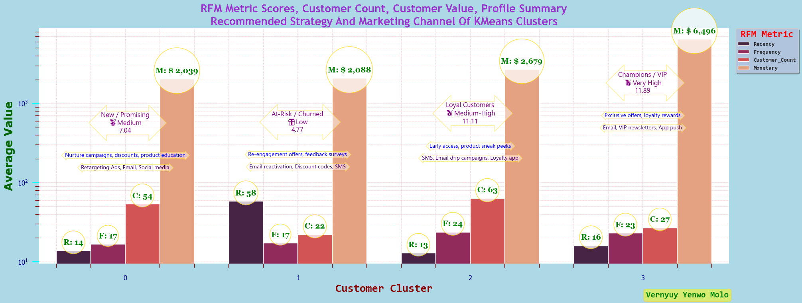  
*Generated using seaborn library*
#
**Scatterplot - Customer Segments - Recency Vs Frequency**
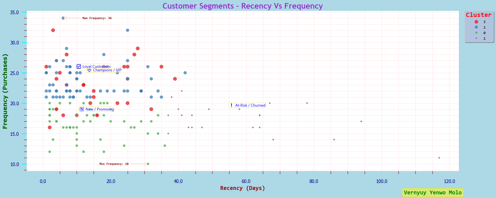  
*Generated using seaborn library*
#
**Scatterplot - Customer Segments - Recency Vs Monetary**
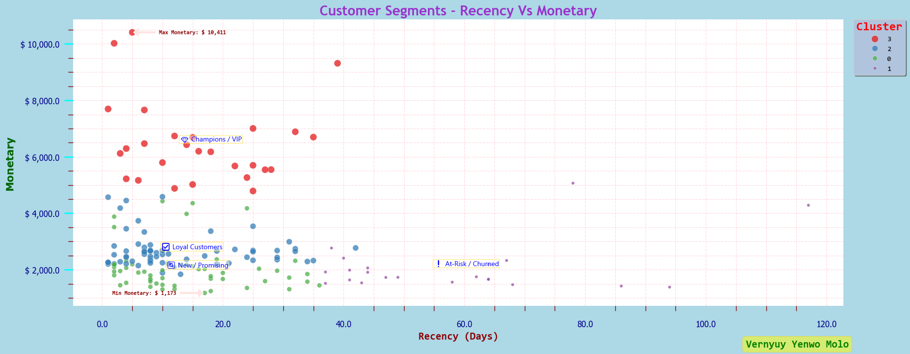  
*Generated using seaborn library*
#
**Scatterplot - Customer Segments - Frequency Vs Monetary**
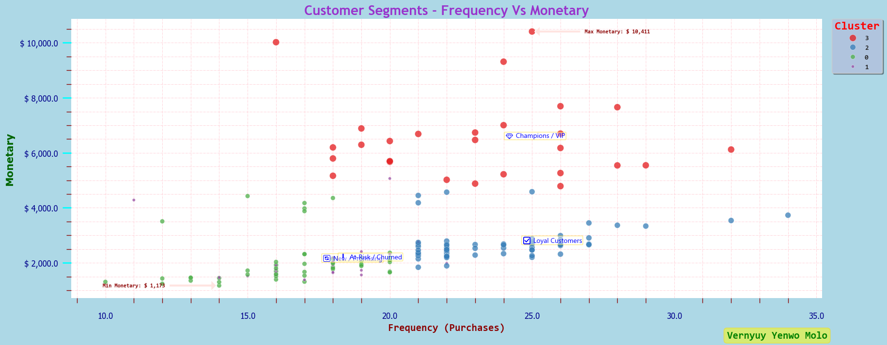  
*Generated using seaborn library*
#
**Heatmap - Customer Segmentation Count Using RFM Analysis**
  
*Generated using seaborn library*
#
**Countplot - Customer Segmentation Count Using RFM Analysis**
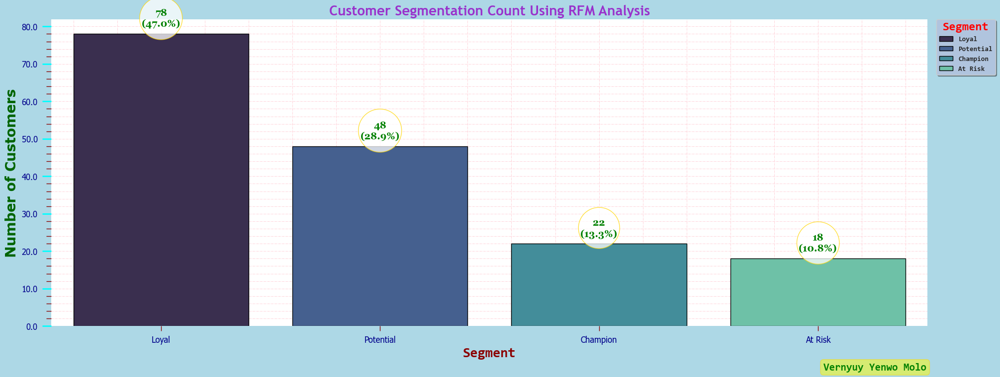  
*Generated using seaborn library*
#
**Scatterplot - Customer Segmentation Using RFM Analysis - Monetary Vs Segment**
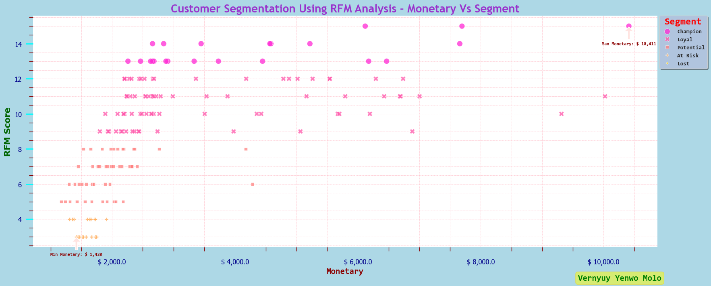  
*Generated using seaborn library*
#

### **🔍 Insights**
 - **TBC**.

#

### 📦 Predicted 6-Month CLTV - Customer Segmentation Using RFM Analysis And K-Means Clustering With Targeting Strategy And Marketing Channels

#### What is CLTV (Customer Lifetime Value)?
- A **`monetary value`** that represents the **`amount of revenue or profit a customer will give the company over the period of the relationship`**.

- A technique used to forecast the total revenue a business expects to generate from a single customer relationship over their entire lifespan.

#### Why is it important?
- It helps businesses understand the long-term value of their customers, enabling them to make more informed decisions about customer acquisition, retention, and marketing strategies.

### Key Metrics Evaluated

#### 6-Month CLTV
 - The CLTV for 6 months was predicted using `lifetimes` library.

#### RFM Analysis
 - Please refer to notes above.

#### K-Means Clustering
 - Please refer to notes above.

### Dataframe Columns
- **`customer_reference_id`**: **Self explanatory**.
- **`Recency`**: **The number of days since last purchase**.
- **`Frequency`**: **The number of purchases**.
- **`Monetary`**: **The total revenue/profit generated**.
- **`R_Score`**: **Recency score**.
- **`F_Score`**: **Frequency score**.
- **`M_Score`**: **Monetary score**.
- **`RFM_Segment`**: **Recency + Frequency + Monetary score**.
- **`Cluster`**: **3**, **2**, **1** and **0**.
- **`predicted_cltv_6m`**: **The predicted CLTV for 6 months**.
- **`cltv_segment`**:	**"Very High"**, **"High"**, **"Medium"**, **"Low"** and **"Very Low"**.
- **`cltv_strategy`**:
    - **Retain + Reward**.
    - **Upsell + Personalise**.
    - **Educate + Re-target**.
    - **Incentivise + Survey**.
    - **Re-engage + Exit**.
- **`cltv_marketing_channel`**:
    - **Email, SMS, App Push, 1:1 service**.   
    - **Email, Paid Ads, Mobile App**.
    - **Email Series, Blog, Social Media**.
    - **Email, Push Notification**.
    - **Email, Re-targeting Ads**.

### **🩺 Diagnostics**
  - Dataframes.
 
### 🖼️ Results Snapshot

#
**Dataframe - Predicted 6-Month CLTV - Customer Segmentation Using RFM Analysis With Targeting Strategy And Marketing Channels**
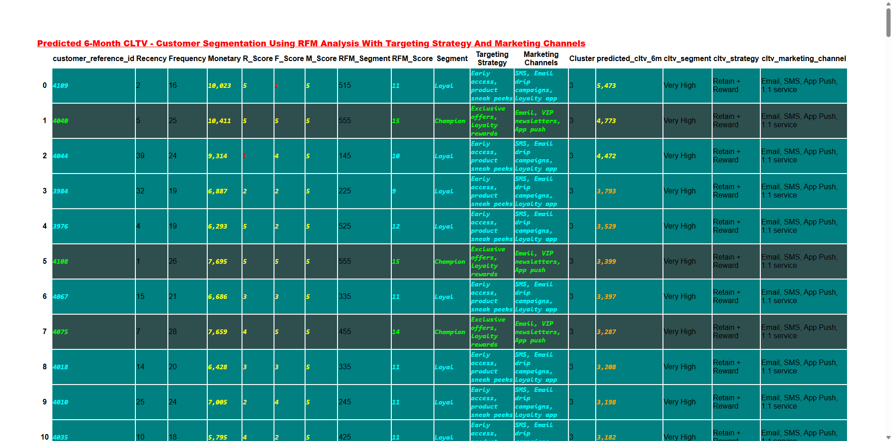  
*Generated using pandas library*
#

### Statistical Analysis Of The Predicted 6-Month CLTV
 - A statistical analysis was done on the predicted CLTV for 6 months.

### Key Metrics Evaluated
1) Descriptive Statistics Of Predicted 6-Month CLTV By **`Cluster`**.
2) Descriptive Statistics Of Predicted 6-Month CLTV By **`Segment`**.
3) Descriptive Statistics Of Predicted 6-Month CLTV By **`Strategy`**.

### Dataframe Columns
- **`Cluster`**: **3**, **2**, **1** and **0**.
- **`Count`**: **The total number of customers**.
- **`avg_predicted_cltv_6m`**: **The mean predicted CLTV for 6 months**.
- **`median_predicted_cltv_6m`**: **The median predicted CLTV for 6 months**.
- **`min_predicted_cltv_6m`**: **The minimum predicted CLTV for 6 months**.
- **`max_predicted_cltv_6m`**: **The maximum predicted CLTV for 6 months**.
- **`cltv_segment`**:	**"Very High"**, **"High"**, **"Medium"**, **"Low"** and **"Very Low"**.
- **`cltv_strategy`**:
    - **Retain + Reward**.
    - **Upsell + Personalise**.
    - **Educate + Re-target**.
    - **Incentivise + Survey**.
    - **Re-engage + Exit**.

### **🩺 Diagnostics**
  - Dataframes.

### 📷 Visualisation

#
**Dataframe - Descriptive Statistics Of Predicted 6-Month CLTV By Cluster**
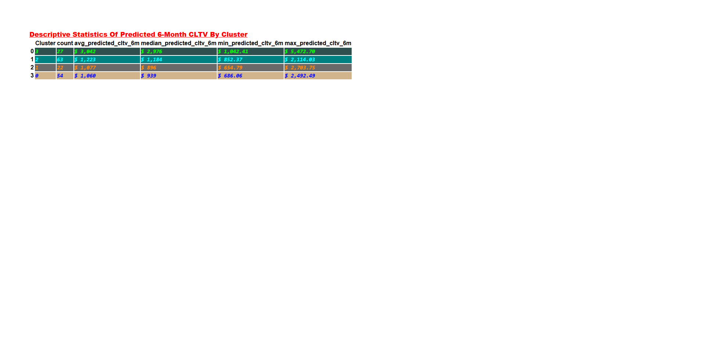  
*Generated using pandas library*
#
**Dataframe - Descriptive Statistics Of Predicted 6-Month CLTV By Segment**
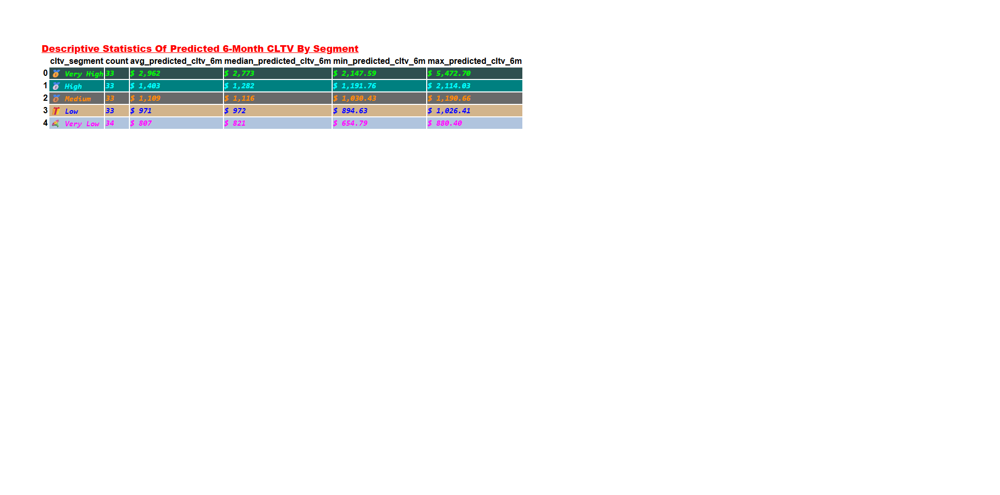  
*Generated using pandas library*
#
**Dataframe - Descriptive Statistics Of Predicted 6-Month CLTV By Strategy**
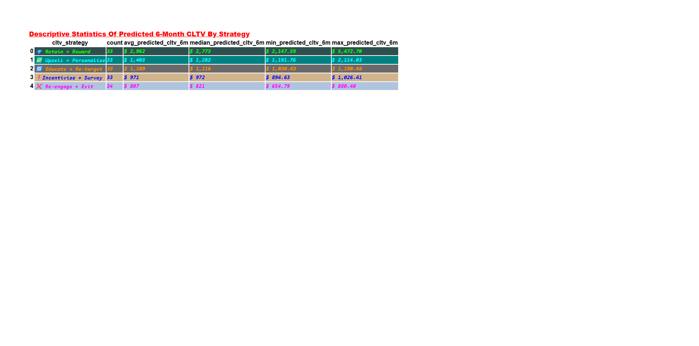  
*Generated using pandas library*
#

### **🔍 Insights**
 - **TBC**.

#

### Distribution Overview Of The Predicted 6-Month CLTV
 - A distribution overview was done on the predicted CLTV for 6 months.

### Key Metrics Evaluated
1) Distribution Of Predicted 6-Month CLTV.
2) Distribution Of Predicted 6-Month CLTV By **`Cluster`**.
3) Distribution Of Predicted 6-Month CLTV By **`Segment`**.
4) Distribution Of Predicted 6-Month CLTV By **`Strategy`**.
5) Distribution Of Predicted 6-Month CLTV By **`Segment (Strategy & Marketing Channel Included)`**.

### **🩺 Diagnostics**
  - Hisplots.
  - Boxplots.

### 📷 Visualisation

#
**Hisplot - Distribution Of Predicted 6-Month CLTV**
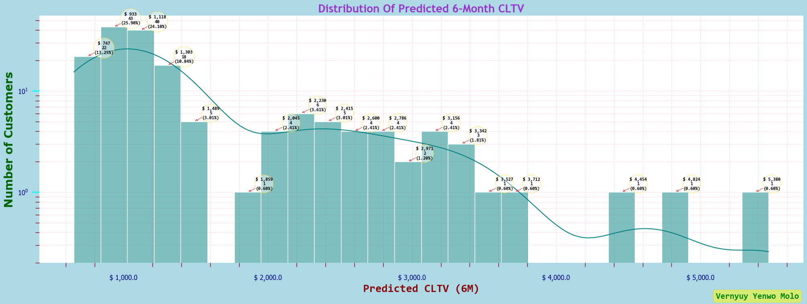  
*Generated using seaborn library*
#
**Hisplot - Distribution Of Predicted 6-Month CLTV By Cluster**
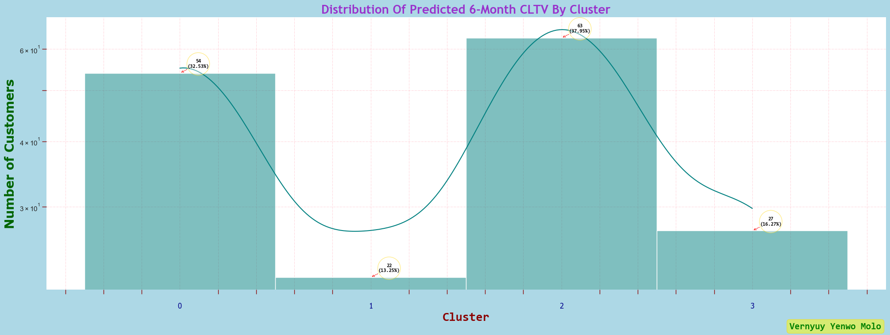  
*Generated using seaborn library*
#
**Hisplot - Distribution Of Predicted 6-Month CLTV By Segement**
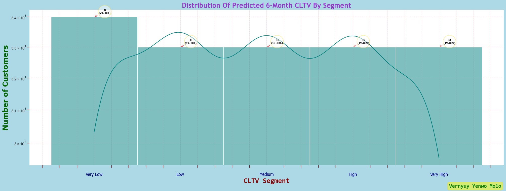  
*Generated using seaborn library*
#
**Hisplot - Distribution Of Predicted 6-Month CLTV By Strategy**
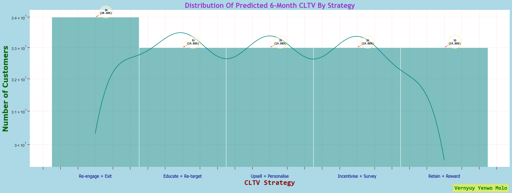  
*Generated using seaborn library*
#
**Boxplot - Distribution Of Predicted 6-Month CLTV By Cluster**
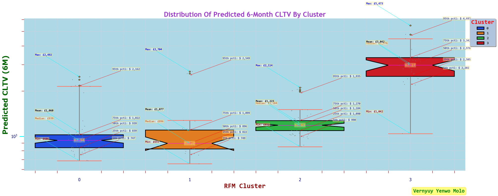  
*Generated using seaborn library*
#
**Boxplot - Distribution Of Predicted 6-Month CLTV By Segment (Strategy & Marketing Channel Included)**
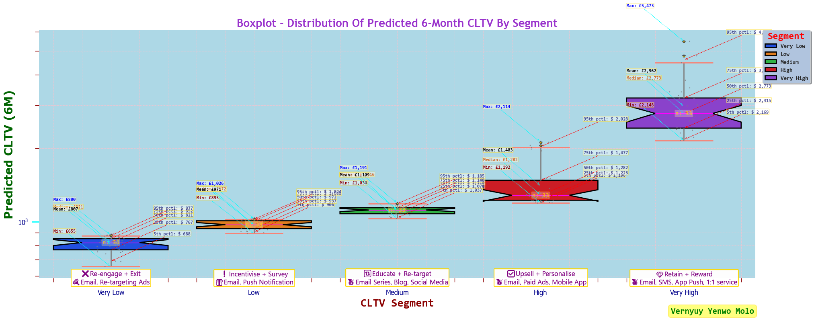  
*Generated using seaborn library*
#
**Boxplot - Distribution Of Predicted 6-Month CLTV By Strategy**
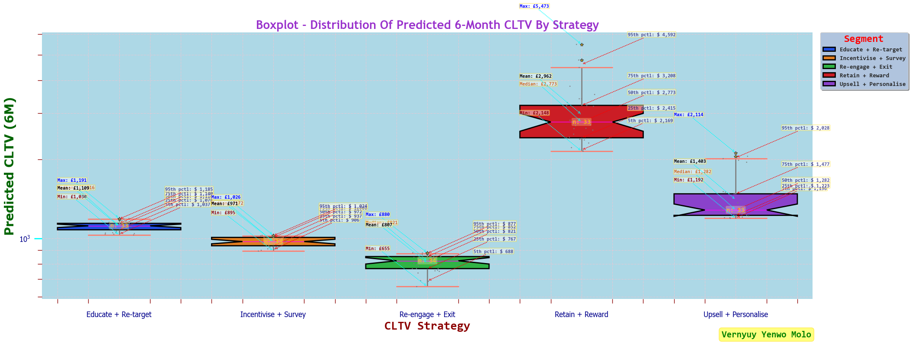  
*Generated using seaborn library*
#

### **🔍 Insights**
 - **TBC**.
#

### Campaign Simulation And ROI Estimation Using Predicted CLTV Segments

#### What Is ROI (Return on Investment)?
 - A **`performance metric`** that measures the **`profitability of an investment`**.

 - It indicates how much return is generated relative to the cost of the investment.

#### Why is it important?
 - By understanding the CLTV, businesses can make more **`informed decisions`** about **`how much to spend`** on **`acquiring`** and **`retaining customers`** to **`maximise`** their overall **`ROI`**.

 - By comparing the cost of acquiring a customer (CAC) and their CLTV, you can assess your ROI.

### Key Metrics Evaluated
 - **`Response Rate`**.
 - **`Cost Per Customer`**.
 - **`Expected Response`**.
 - **`Expected Revenue`**.
 - **`Total Cost`**.
 - **`Profit`**.
 - **`ROI %`**.

### 🧮 Financial Math
 - Response Rate = Customer response value to simulated campaign
 - Cost Per Customer = Customer aquisition cost
 - Expected Response = Customers * Response Rate
 - Expected Revenue = Expected_responses * Mean 6-month CLTV * Response Rate
 - Total Cost = Customers * Cost Per Customer
 - Profit = Expected Revenue - Total Cost
 - ROI % = (Expected Revenue - Total Cost) / (Total Cost * 100)

### Dataframe Columns
- **`cltv_segment`**:	**: **"Very High"**, **"High"**, **"Medium"**, **"Low"** and **"Very Low"**.
- **`avg_cltv`**: **The mean predicted CLTV for 6 months**.
- **`Customers`**: **The total number of customers**.
- **`cost_per_customer`**: **The aquisition cost per customer**.
- **`total_cost`**: **The total cost of aquiring customers**.
- **`expected_revenue`**: **Estimate of how much money the business expects to earn over a specific period—whether that's a month, a quarter, or a full year.**.
- **`profit`**: **The money you have left after paying for business expenses. There are three main types of profit: gross profit, operating and net profit.**.
- **`roi_percent`**: **The return on investment expressed as a percentage**.

### **🩺 Diagnostics**
  - Dataframe.

### 📷 Visualisation

#
**Dataframe - Campaign Simulation And ROI Estimation Using Predicted CLTV Segments**
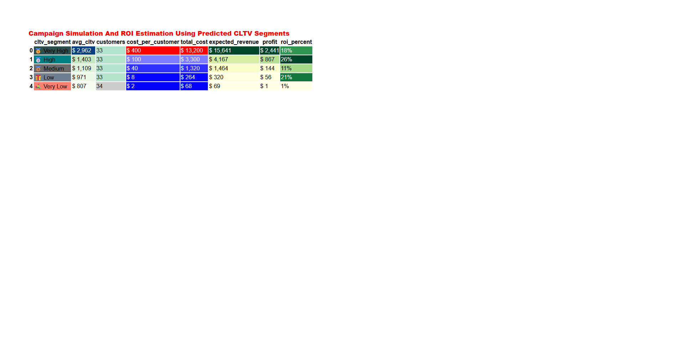  
*Generated using pandas library*
#

### **🔍 Insights**
 - **TBC**.

#

### Churn Prediction And Logistic Regression Model

#### What Is The Purpose Of Churn Prediction?

- Finds the **`75th`** or **`95th percentile`** of **`recency`**.

- Flags customers in the **`top 25%`** or **`top 5%`** of **`inactivity`** as **`churned`**.

- Offers flexibility — you can change to **`.quantile(0.80)`** for a more **`aggressive threshold`**.

#### Auto-calculated churn threshold (95th percentile)
- **`63 days`**.

### Key Metrics Evaluated
1) Top 10 Customers By CLTV-Days.
2) Top 10 Customers By CLTV-Months.
3) Strategic Insights: Correlation Analysis Of Key Metrics.
4) Recency Distribution.
5) Churn Threshold.
6) Top 5 Active Customers.
7) Top 5 Churned Customers.

### Dataframe Columns
- **`customer_reference_id`**: **The customer ID**.
- **`cltv_days`**: **The pedicted total revenue/profit generated over the period of the relationship in days (Short-term campaigns, daily churn modelling..)**.
- **`cltv_months`**: **The pedicted total revenue/profit generated over the period of the relationship in months (Business forecasting and marketing budgets)**.
- **`monetary`**: **The total revenue/profit generated**.
- **`avg_order_value`**: **The mean amount spent on an order**.
- **`first_purchase`**: **The first purchase**.
- **`last_purchase`**: **The last purchase**.
- **`recency`**: **The number of days since last purchase**.
- **`frequency`**: **The number of purchases**.
- **`customer_lifespan_days`**: **The period of time in days the customer has been continuously ordering**.
- **`purchase_freq_daily`**: **The average number of orders placed per day**.
- **`cltv_tier_days`**: **"Very High"**, **"High"**, **"Medium"**, **"Low"** and **"Very Low"**.
- **`cltv_tier_months`**: **"Very High"**, **"High"**, **"Medium"**, **"Low"** and **"Very Low"**.
- **`customer_value`**: 
  - **"VIP Revenue Drivers"**.
  - **"High Value Customers"**.
  - **"Growth Opportunity Customers"**.
  - **"Low Value Customers"**.
  - **"Dormant or At-Risk"**.
- **`recommended_strategy`**: 
  - **"Prioritise with exclusive perks, early access to launches, loyalty programs, and 1:1 service"**.
  - **"Upsell premium products, cross-sell related items, reward referrals"**.
  - **"Educate on product benefits, send tailored content and offers to increase engagement"**.
  - **"Encourage repeat purchases with discounts or bundle deals, explore churn reasons"**.
  - **"Re-engagement campaigns, win-back emails, limited-time incentives, or exit surveys"**.
- **`suggested_channels`**:
  - **"Email, SMS, Personalised landing"**.
  - **"Email, Paid Ads, Mobile App"**.
  - **"Email Series, Blog, Social Media"**.
  - **"Email, Push Notification"**.
  - **"Email, Re-targeting Ads"**.
- **`frequency`**:
  - **"Weekly"**.
  - **"Bi-weekly"**.
  - **"Weekly"**.
  - **"Monthly"**.
  - **"Immediate"**.
- **`churn_status`**: **Active** and **Churned** .

### **🩺 Diagnostics**
  - Dataframes.
  - Heatmap.
  - Histplot.

### 🖼️ Results Snapshot

#
**Top 10 Customers By CLTV-Days**
|customer_id|cltv_days|avg_order_value|total_orders|customer_lifespan_days|purchase_freq_daily|cltv_tier_days|customer_value|recommended_strategy|suggested_channels|frequency|
|-------|-------|---------|--------------|--------|---------|---------------|--------------|--------------------|------|----|
|4040|$ 10,363.0|416.0|25 |346|0.072|Very High|VIP Revenue Drivers|Prioritise with exclusive perks, early access to launches, loyalty programs, and 1:1 service|Email, SMS, Personalised landing|Weekly|
|4109|$ 10,021.0|626.0|16|348|0.046|Very High|VIP Revenue Drivers|Prioritise with exclusive perks, early access to launches, loyalty programs, and 1:1 service|Email, SMS, Personalised landing|Weekly|
|4044|$ 9,321.0|388.0|24|312|0.077|Very High|VIP Revenue Drivers|Prioritise with exclusive perks, early access to launches, loyalty programs, and 1:1 service|Email, SMS, Personalised landing|Weekly|        
|4108|$ 7,671.0|296.0|26|365|0.071|Very High|VIP Revenue Drivers|Prioritise with exclusive perks, early access to launches, loyalty programs, and 1:1 service|Email, SMS, Personalised landing|Weekly|        
|4075|$ 7,651.0|274.0|28|358|0.078|Very High|VIP Revenue Drivers|Prioritise with exclusive perks, early access to launches, loyalty programs, and 1:1 service|Email, SMS, Personalised landing|Weekly|        
|4010|$ 7028.0|292.0|24|339|0.071|Very High|VIP Revenue Drivers|Prioritise with exclusive perks, early access to launches, loyalty programs, and 1:1 service|Email, SMS, Personalised landing|Weekly|      
|3984|$ 6,912.0|362.0|19|285|0.067|Very High|VIP Revenue Drivers|Prioritise with exclusive perks, early access to launches, loyalty programs, and 1:1 service|Email, SMS, Personalised landing|Weekly|      
|4103|$ 6,733.0|293.0|23|343|0.067|Very High|VIP Revenue Drivers|Prioritise with exclusive perks, early access to launches, loyalty programs, and 1:1 service|Email, SMS, Personalised landing|Weekly|    
|4002|$ 6,708.0|258.0|26|321|0.081|Very High|VIP Revenue Drivers|Prioritise with exclusive perks, early access to launches, loyalty programs, and 1:1 service|Email, SMS, Personalised landing|Weekly|       
|4067|$ 6,703.0|318.0|21|310|0.068|Very High|VIP Revenue Drivers|Prioritise with exclusive perks, early access to launches, loyalty programs, and 1:1 service|Email, SMS, Personalised landing|Weekly|   
#
**Top 10 Customers By CLTV-Months**
|customer_id|cltv_months|avg_order_value|total_orders|customer_lifespan_months|purchase_freq_monthly|cltv_tier_months|customer_value|recommended_strategy|suggested_channels|frequency|
|-------|-------|---------|--------------|--------|---------|---------------|--------------|--------------------|------|----|
|4040|$ 10,833.0|416.0|25 |12.0|2.17|Very High|VIP Revenue Drivers|Prioritise with exclusive perks, early access to launches, loyalty programs, and 1:1 service|Email, SMS, Personalised landing|Weekly|
|4109|$ 10,367.0|626.0|16|12.0|1.38|Very High|VIP Revenue Drivers|Prioritise with exclusive perks, early access to launches, loyalty programs, and 1:1 service|Email, SMS, Personalised landing|Weekly|
|4044|$ 8,963.0|388.0|24|10.0|2.31|Very High|VIP Revenue Drivers|Prioritise with exclusive perks, early access to launches, loyalty programs, and 1:1 service|Email, SMS, Personalised landing|Weekly|        
|4075|$ 7,727.0|274.0|28|12.0|2.35|Very High|VIP Revenue Drivers|Prioritise with exclusive perks, early access to launches, loyalty programs, and 1:1 service|Email, SMS, Personalised landing|Weekly|        
|4108|$ 7,601.0|296.0|26|12.0|2.14|Very High|VIP Revenue Drivers|Prioritise with exclusive perks, early access to launches, loyalty programs, and 1:1 service|Email, SMS, Personalised landing|Weekly|        
|3984|$ 7240.0|362.0|19|10.0|2.00|Very High|VIP Revenue Drivers|Prioritise with exclusive perks, early access to launches, loyalty programs, and 1:1 service|Email, SMS, Personalised landing|Weekly|      
|4002|$ 6,896.0|258.0|26|11.0|2.43|Very High|VIP Revenue Drivers|Prioritise with exclusive perks, early access to launches, loyalty programs, and 1:1 service|Email, SMS, Personalised landing|Weekly|      
|4010|$ 6,809.0|292.0|24|11.0|2.12|Very High|VIP Revenue Drivers|Prioritise with exclusive perks, early access to launches, loyalty programs, and 1:1 service|Email, SMS, Personalised landing|Weekly|    
|3986|$ 6,677.0|281.0|23|12.0|1.98|Very High|VIP Revenue Drivers|Prioritise with exclusive perks, early access to launches, loyalty programs, and 1:1 service|Email, SMS, Personalised landing|Weekly|       
|4103|$ 6,478.0|293.0|23|11.0|2.01|Very High|VIP Revenue Drivers|Prioritise with exclusive perks, early access to launches, loyalty programs, and 1:1 service|Email, SMS, Personalised landing|Weekly|                                                                                                             
#

### 📷 Visualisation

#
**Barplot - Top 10 Customers By CLTV-Days**
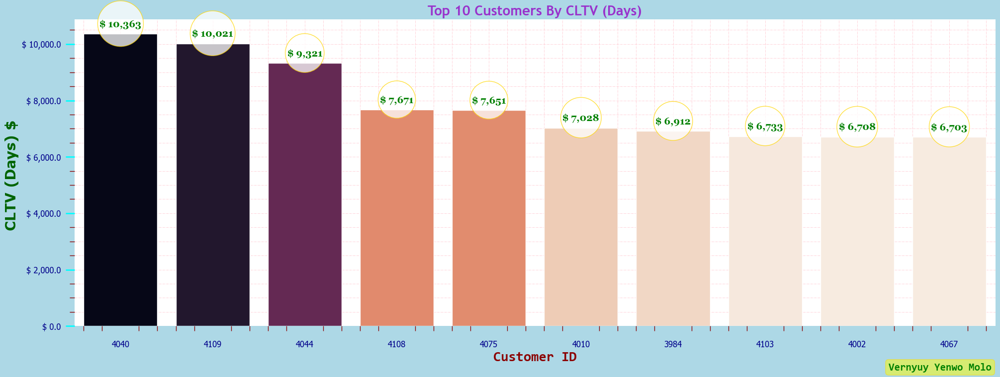  
*Generated using seaborn library*
#
**Barplot - Top 10 Customers By CLTV-Months**
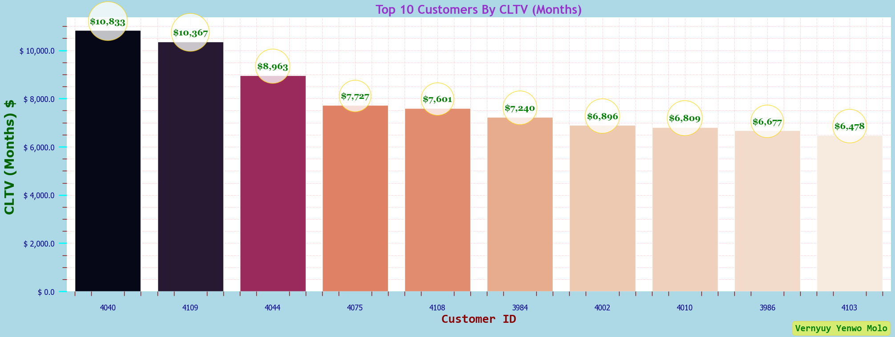   
*Generated using seaborn library*
#
**Heatmap - Strategic Insights: Correlation Analysis Of Key Metrics**
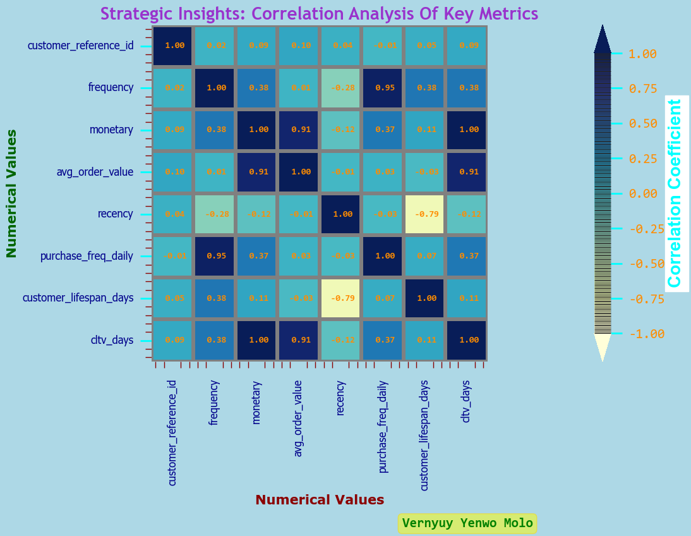   
*Generated using seaborn library*
#
**Histplot - Recency Distribution**
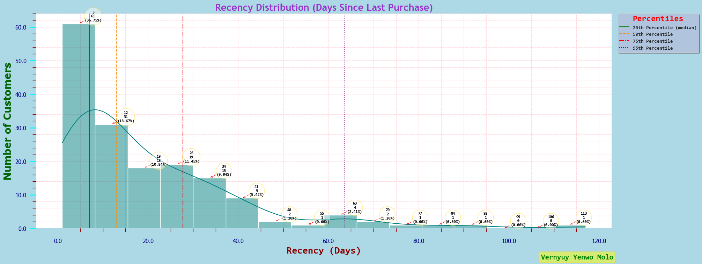   
*Generated using seaborn library*
#
**Dataframe - Top 5 Active Customers**
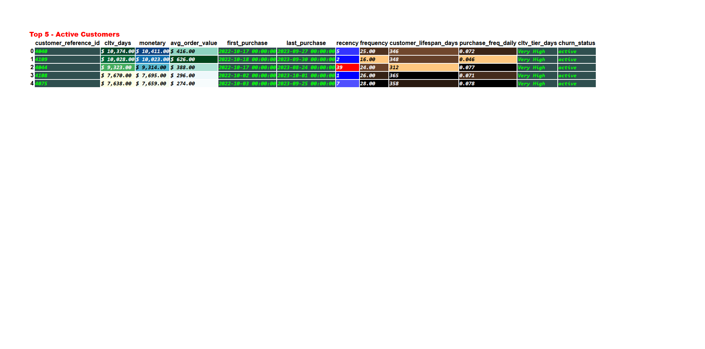   
*Generated using pandas library*
#
**Dataframe - Top 5 Churned Customers**
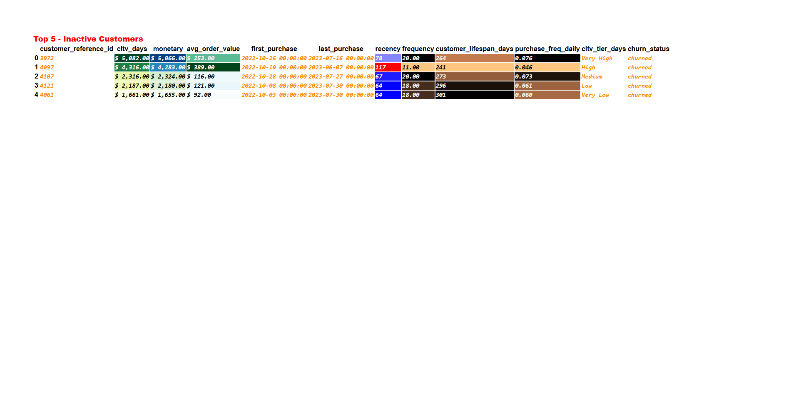   
*Generated using pandas library*
#

### **🔍 Insights**
 - **TBC**.

#

### 🎯 Campaign Optimisation
- Targeting rules built using RFM + CLTV outputs
- Simulated campaign strategies for uplift impact
- Laid foundation for **A/B testing** and **Uplift Modeling**

#

## 📬 Contact
*Built by [Arkyl Trulock](https://github.com/ArkylTrulock)*  
For collaborations or feedback: X@gmail.com 