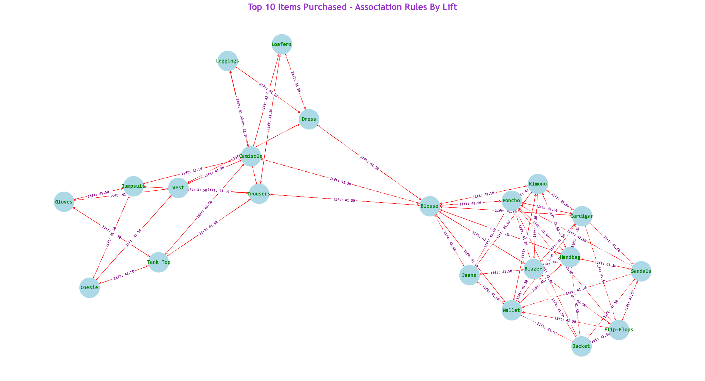
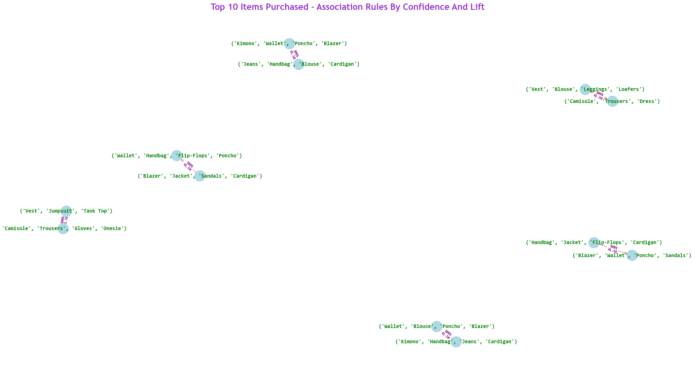
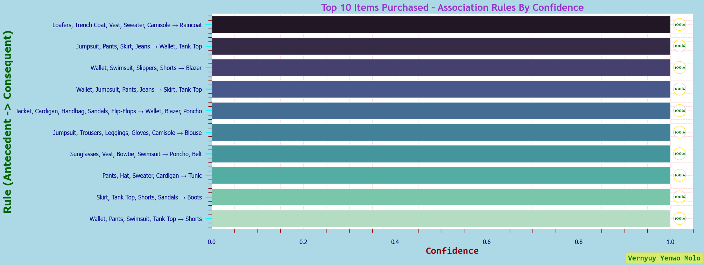
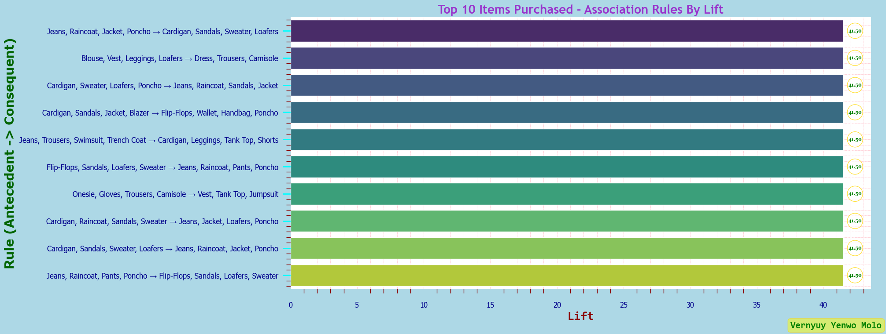
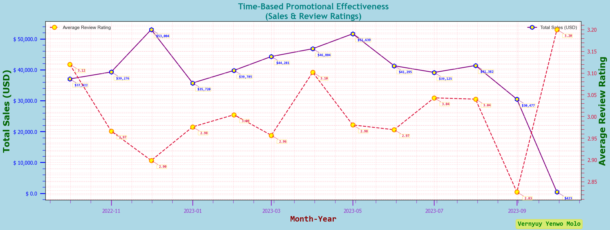
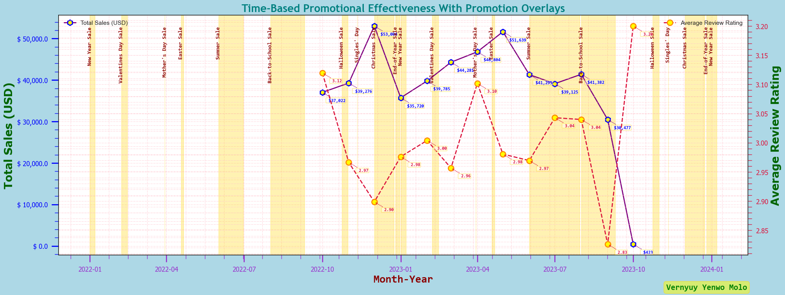
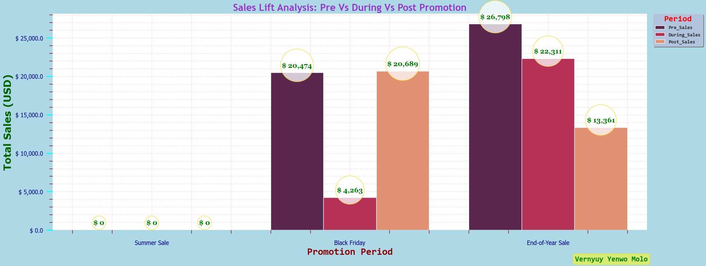

# 🧠 Prescriptive Sales Analysis for Fashion Retail

#
## 📌 Project Overview

This project focuses on **Prescriptive Analytics** techniques to identify **what actions to take** to optimize sales and customer retention in a fashion retail setting. Building on previous descriptive and predictive analyses, we dive into:

- 🧺 **Basket Analysis** using the **Apriori algorithm**  
- 📈 **Promotion Effectiveness** based on temporal windows  
- 💥 **Sales Lift Analysis** comparing pre-, during-, and post-promotion periods  
- 📊 **Customer Segmentation** using **RFM Analysis + CLTV**  
- 🧪 **Campaign Simulation & Optimisation** for targeting high-value segments

#

## 🧰 Tech Stack
- Python (`pandas`, `numpy`, `seaborn`, `sklearn`, `statsmodels`,`prophet`, `pmdarima`, `networkx`, `mlxtend`, `lifetimes`)  
- Jupyter Notebook 

#

## 🧠 Methods & Tools
### **Python Libraries**:

- **Pandas**: Data analysis and manipulation. 
- **Numpy**: Scientific computing.  
- **Seaborn**: Statistical data visualisation.
- **Scikit-learn**: Clustering and uplift modeling.
- **Statsmodels**: Statistical modeling and forecasting.
- **Networkx**: Creation, manipulation, and study of the structure, dynamics, and functions of complex networks.
- **Mlxtend (Machine Learning Extensions)**: Apriori Association Rules.
- **Lifetimes**: Forecasting the total revenue a business expects to generate from a single customer relationship over their entire lifespan.

#

## 🔍 Key Techniques & Methodologies

### 🧺 Apriori Algorithm & Association Rule Mining (Apriori)
- Association rule mining has become essential for businesses aiming to understand customer behaviors and purchasing patterns. 
- This technique identifies items frequently bought together, helping companies optimize product placement, promotions, and recommendations.
- Such analysis improves business strategies by clearly revealing trends hidden within transaction data.
 
### Key Metrics Evaluated
- **Support**: The frequency with which an item appears in the dataset. (`How often the rule occurs in data`) 
- **Confidence**: The likelihood that item B is purchased when item A is purchased. (`Probability of B given A`) 
- **Lift**: The strength of a rule. (`measuring how much more likely item B is bought when item A is bought compared to when bought independently`)

### 🏦Visualisations

#
**Network Plot 1 - Top 10 Items Purchased - Association Rules By Lift**
  
*Generated using seaborn library*
#
**Network Plot 2 - Top 10 Items Purchased - Association Rules By Confidence And Lift**
  
*Generated using seaborn library*
#
**Barplot - Top 10 Items Purchased - Association Rules By Confidence**
  
*Generated using seaborn library*
#
**Barplot - Top 10 Items Purchased - Association Rules By Lift**
  
*Generated using seaborn library*
#

### 🛒 Time-Based Promotion Effectiveness
- Analysed impact of promotional events on sales volume
- Categorised sales into:
  - **Pre-Promotion**
  - **During Promotion**
  - **Post-Promotion**

### 🏦Visualisations

#
**Lineplot - Time-Based Promotional Effectiveness**
  
*Generated using seaborn library*
#
**Lineplot - Time-Based Promotional Effectiveness With Promotion Overlays**
  
*Generated using seaborn library*
#

### 📉 Sales Lift Analysis (Pre vs During vs Post Promotion)
- Quantified the **true effectiveness** of promotions
- Metrics included:  
  - Absolute sales change  
  - Relative % improvement  
  - Baseline vs. uplift performance

### 🏦Visualisation

#
**Barplot - Sales Lift Analysis: Pre Vs During Vs Post Promotion**
  
*Generated using seaborn library*
#

### 📦 RFM Segmentation + CLTV
- **Recency**, **Frequency**, and **Monetary** values used to segment customers
- Combined with **Historical CLTV** to estimate customer value
- Result:
  - Profiled RFM: **3**, **2**, **1** and **0**
  - Profiled RFM segments: **"Champions"**, **"Loyal"**, **"Potential"**, **"At Risk"** and **"Lost"**
  - Profiled cltv segments: **"Very High"**, **"High"**, **"Medium"**, **"Low"** and **"Very Low"**
  - Profiled cltv strategies: **"Retain + Reward"**, **"Upsell + Personalise"**, **"Educate + Re-target"**, **"Incentivise + Survey"** and **"Re-engage + Exit"**
  - Profiled cltv marketing channels: **"Email, SMS, App Push, 1:1 service"**, **"Email, Paid Ads, Mobile App"**, **"Email Series, Blog, Social Media"**, **"Email, Push Notification"** and **"Email, Re-targeting Ads"**

### 🎯 Campaign Optimisation
- Targeting rules built using RFM + CLTV outputs
- Simulated campaign strategies for uplift impact
- Laid foundation for **A/B testing** and **Uplift Modeling**
